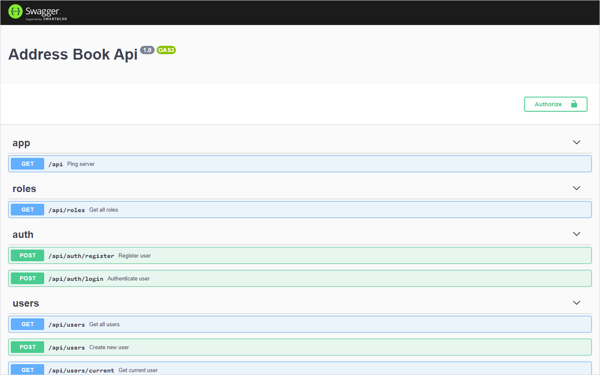

# Address Book Server

This is server part of Address Book project which allows you to manage contacts. [See it in action.](https://mmustra-address-book.herokuapp.com)

  

  &nbsp;&nbsp;&nbsp;
  &nbsp;&nbsp;&nbsp;
  &nbsp;&nbsp;&nbsp;
  

## Table of Contents

- [About](#about)
- [Usage](#usage)
- [Features](#features)
- [Technologies](#technologies)
- [Development](#development)

## About 

TLDR: [Address Book DEMO](https://mmustra-address-book.herokuapp.com) | [Address Book Api](https://mmustra-address-book.herokuapp.com/api/documentation)

Server that connects to MonogoDB exposing guarded api. Models are set using middlewares and hooks directly from Mongoose. Migrations and seed will prepare DB for intital state as well for future changes. Entire project has global config for easy control and documentation is provided by Swagger. Aside of that there are extra features like file logging and static file serve depending on need. For more info about frontend, check out [client part](https://github.com/mmustra/address-book-client) built with Angular 8 and Ant Design UI.

## Usage 

Using your favorite REST client test the api or check out the swagger documentation.

| Roles     | User Actions            | Contact Actions         |
| --------- | ----------------------- | ----------------------- |
| Admin     | CRUD `any` / RU\* `own` | CRUD `any` / CRUD `own` |
| Moderator | R `any*` / RU\* `own`   | RU `any*` / CRUD `own`  |
| User      | - `any` / RU\* `own`    | - `any` / CRUD`own`     |

any\* - except Admin  
U\* - except protected users

## Features 

- Mongoose pre/post hooks, pagination, fuzzy-search, aggregations, validations
- Authenticate, Access control, and custom guards
- Global exception filter, standardized error message format
- Migrations and seed data
- Static file server
- Swagger documentation
- DTO validators
- Global config
- File logger

## Technologies 

- NestJS
- Mongoose
- PassportJS
- Swagger
- Class Validator
- Class Transformer
- Faker
- Helmet

## Development 

Run `npm run start:dev` for a dev server. Navigate to `http://localhost:3000/api/documentation` for swagger documentation.

#### Requirements

- Node [v10.16.3](https://nodejs.org/download/release/v12.13.0/), Npm v6.9.0, (you can use [nvm](https://github.com/nvm-sh/nvm) or [nvm-windows](https://github.com/coreybutler/nvm-windows))
- Nest Cli [v6.14.0](https://www.npmjs.com/package/@nestjs/cli/v/6.14.0)

#### IDE

[Visual Studio Code](https://code.visualstudio.com/) is recommended. [Prettier](https://prettier.io/) is used as formater for the project.

#### REST Client

This project was developed with help of [Insomnia](https://insomnia.rest/), but you can use what ever suits you.

#### Code style

Be sure to follow current folder structure and code style in the project. Use Typescript to create better code environment with your contributions. Before adding new packages to project be sure to first check `package.json` for possible duplicates.

For generating new nest components use `nest generate`.  
Example: `nest generate controller controller-name`

To get more help on the Nest CLI check out the [Nest CLI README](https://docs.nestjs.com/cli/usages).

#### Scripts

##### Serve

Run `npm run start` to serve the project. Use `npm run start:dev` for watch mode and `npm run start:prod` for a production mode.

##### Build

Run `npm run build` to build the project. The build artifacts will be stored in the `dist/` directory.

##### Running unit tests

Run `npm run test` to execute the unit tests and `npm run test:e2e` to execute the end-to-end tests.

## License

The MIT License ([MIT](./LICENSE))  
Copyright (c) 2020-present, Marin Muštra
